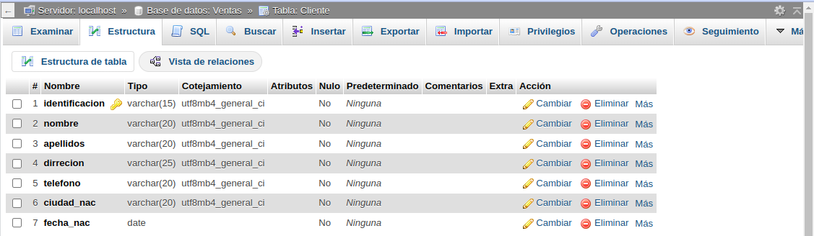
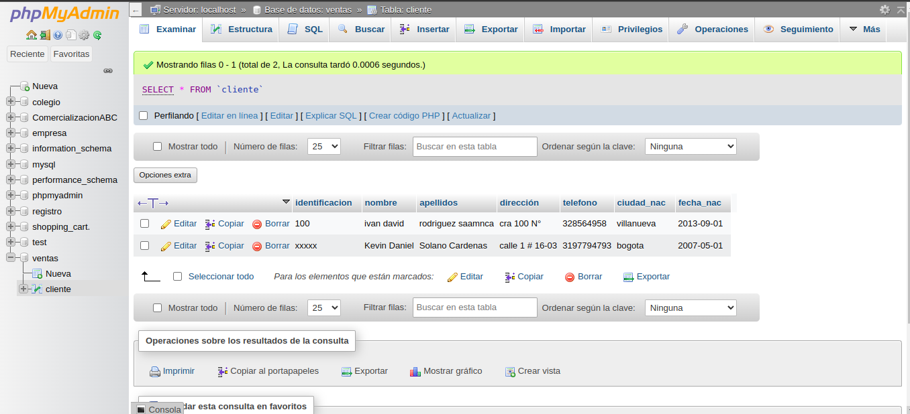

# Introduccion a SQL

1.creacion de una base de datos (BD) con MySql usando phpmyAdmin
## Creacion tabla cliente
### DICCIONARIO DE DATOS
|Campo|Tipo de dato|Longitud|
|-----|------------|--------|
|*identificacion|varchar|15|
|nombre|varchar|20|
|apellidos|varchar|20|
|direccion|varchar|25|
|telefono|varchar|20|
|ciudad_nac|varchar|20|
|fecha_nac|date||

## codigo  de datos
CREATE TABLE `Ventas`.`Cliente` (`identificacion` VARCHAR(15) NOT NULL , `nombre` VARCHAR(20) NOT NULL , `apellidos` VARCHAR(20) NOT NULL , `direccion` VARCHAR(25) NOT NULL , `telefono` VARCHAR(20) NOT NULL , `ciudad_nac` VARCHAR(20) NOT NULL , `fecha_nac` DATE NOT NULL , PRIMARY KEY (`identificacion`)) ENGINE = InnoDB;
### Diccionario de datos en phpMyAdmin 

### codigo de registro de datos en tabla Cliente

INSERT INTO `Cliente` (`identificacion`, `nombre`, `apellidos`, `direccion`, `telefono`, `ciudad_nac`, `fecha_nac`) VALUES ('100', 'Danny Ferney', 'Ardila Ardila', 'calle 3 #15-21', '3165736850', 'Encino', '2013-03-08');

